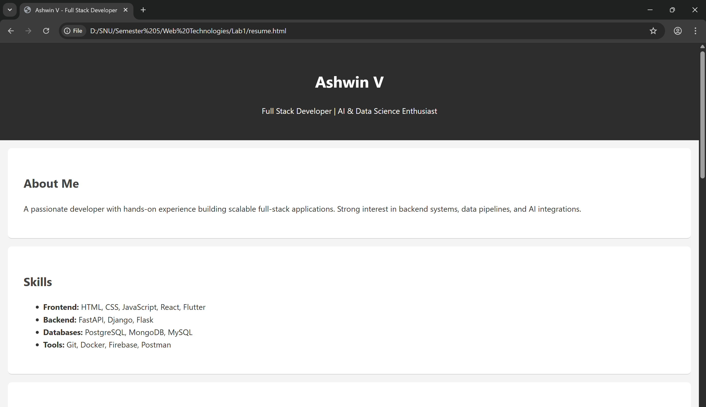
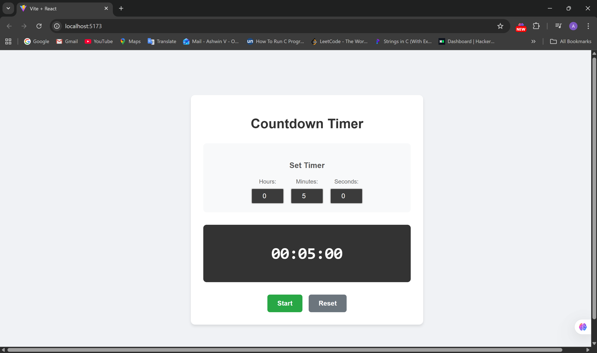
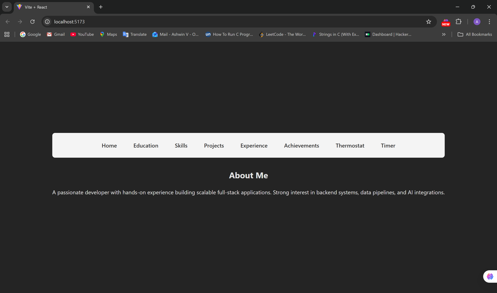

Here’s a cleaner, more _human_, slightly more relaxed version — still polished but not corporate-level formal.
I’ve kept the structure intact while toning down the seriousness, making it more student-friendly and authentic.

---

# **Web Technologies – Semester 5 Lab Exercises**

[](https://github.com/ashvp/Web-Technologies---Semester-5)
[](LICENSE)

A collection of all my Web Technologies lab work from Semester 5; everything from basic HTML pages to full React apps and simple Node.js servers.
If you're going through the same course or just exploring web dev, this repo might save you a few headaches. 😉

---

## 📚 Table of Contents

- [Overview](#overview)
- [Lab Exercises](#lab-exercises)
- [Technologies Used](#technologies-used)
- [Installation & Setup](#installation--setup)
- [Project Structure](#project-structure)
- [Lab Details](#lab-details)
- [Screenshots](#screenshots)
- [Contributing](#contributing)
- [License](#license)
- [Contact](#contact)

---

## 🌟 Overview

This repository contains 10 labs covering the main concepts taught in the Web Technologies course.
The labs gradually move from simple webpages → JavaScript → React → Bootstrap → Node.js. Its basically the whole web dev starter pack.

**What can be learned along the way:**

- Writing clean HTML & CSS
- JavaScript DOM manipulation
- Fetching APIs and working with real data
- Building React components & using hooks
- Setting up routing with React Router
- Creating simple backends with Node.js
- Putting everything together into small full-stack projects

---

## 🧪 Lab Exercises

### **Lab 1: HTML & CSS**

- Build a resume + CV
- Practice Flexbox, Grid, responsiveness

### **Lab 2: JavaScript Weather App**

- Fetch API
- DOM manipulation
- Error handling

### **Lab 3: Advanced JavaScript**

- Calculator
- Form validation
- Local Storage

### **Lab 4: React Basics**

- Components, props, lists
- JSX fundamentals

### **Lab 5: React State Management**

- Temperature converter using `useState`
- Celsius ↔ Fahrenheit logic

### **Lab 6: React useEffect**

- Countdown timer
- Start/stop/reset
- Timers & intervals

### **Lab 7: React Router Multi-Page App**

- Portfolio-like site with 8 pages
- Integrated the previous two labs into it

### **Lab 8: Bootstrap**

- Blog dashboard
- Cards, navbars, responsive grid

### **Lab 9: Node.js Server**

- Simple HTTP server
- Basic routing

### **Lab 10: Node.js + Logging**

- Logging middleware
- Writing logs to a file

---

## 🛠️ Technologies Used

**Frontend:** HTML5, CSS3, JavaScript, React, Bootstrap
**Backend:** Node.js
**Other:** React Router DOM, Fetch API

---

## 📦 Installation & Setup

### **Clone the repo**

```bash
git clone https://github.com/ashvp/Web-Technologies---Semester-5.git
cd Web-Technologies---Semester-5
```

### **For React labs (Lab 4–8)**

```bash
cd Lab7
npm install
npm run dev
```

### **For Node.js labs (Lab 9–10)**

```bash
cd Lab9
node server.js
    (or)
node --watch server.js (restarts the server automatically when changes are made)
```

### **For HTML-only labs**

Just open `index.html` in your browser (or use VS Code Live Server).

---

## 📁 Project Structure

```
Web-Technologies---Semester-5/
│
├── Lab1/                      # HTML & CSS Resume/CV
│   ├── resume.html
│   ├── cv.html
│   ├── styleResume.css
│   └── styleCV.css
│
├── Lab2/                      # Weather Dashboard
│   ├── index.html
│   ├── style.css
│   └── script.js
│
├── Lab3/                      # Advanced JavaScript
│   ├── index.html
│   ├── style.css
│   └── script.js
│
├── Lab4/                      # React Basics
│   ├── Page 1/
│   ├── Page 2/
│   ├── Page 3/
│   └── components/
│
├── Lab5/                      # Temperature Converter
│   ├── App.jsx
│   ├── App.css
│   └── components/
│       ├── TemperatureDisplay.jsx
│       ├── TemperatureControls.jsx
│       ├── TemperatureInC.jsx
│       └── TemperatureInF.jsx
│
├── Lab6/                      # Countdown Timer
│   ├── App.jsx
│   ├── App.css
│   └── components/
│       ├── Title.jsx
│       ├── TimeSetter.jsx
│       ├── TimerDisplay.jsx
│       └── ControlButtons.jsx
│
├── Lab7/                      # Multi-Page React App
│   ├── App.jsx
│   ├── App.css
│   └── components/
│       ├── Home.jsx
│       ├── Education.jsx
│       ├── Skills.jsx
│       ├── Projects.jsx
│       ├── Experience.jsx
│       ├── Achievements.jsx
│       ├── Thermostat.jsx
│       └── Timer.jsx
│
├── Lab8/                      # Bootstrap Blog Dashboard
│   ├── App.jsx
│   └── components/
│       ├── NavigationBar.jsx
│       ├── Dashboard.jsx
│       └── BlogCard.jsx
│
├── Lab9/                      # Node.js HTTP Server
│   ├── server.js
│   ├── routes/
│   │   ├── home.js
│   │   ├── posts.js
│   │   └── error.js
│   ├── data/
│   │   └── BlogPosts.js
│   └── components/
│       ├── homePage.html
│       ├── blog.html
│       └── error.html
│
├── Lab10/                     # Node.js with Logging
│   ├── server.js
│   ├── routes/
│   │   ├── home.js
│   │   └── about.js
│   ├── utils/
│   │   └── logger.js
│   ├── components/
│   │   ├── home.html
│   │   └── about.html
│   └── Logs.txt
│
└── README.md
```

---

## 📖 Lab Details

### **Lab 5: Temperature Converter**

- Convert Celsius ↔ Fahrenheit
- Buttons + input field
- Props for communication
- Simple React state flow

### **Lab 6: Countdown Timer**

- Time setter
- Timer display
- Controls (start / stop / reset)
- Uses `useEffect` for intervals

### **Lab 7: React Router App**

- Eight routes
- Portfolio-style layout
- Integrates Lab 5 and Lab 6
- Component reusability + navigation

### **Lab 9 & 10: Node.js Backend**

- Simple servers made using the built-in `http` module
- Modular routing
- File-based logging (Lab 10)

---

## 📸 A few Screenshots

### Lab 1



### Lab 5


### Lab 6



### Lab 7



---

## 🤝 Contributing

Found a bug? Want to improve a lab?
Feel free to:

1. Fork the repo
2. Create a branch
3. Commit changes
4. Open a PR

Always welcome!

---

## 📝 License

MIT License – see the [LICENSE](LICENSE) file.

---

## 📞 Contact

**Ashwin** – [@ashvp](https://github.com/ashvp)

Repo Link:
[https://github.com/ashvp/Web-Technologies---Semester-5](https://github.com/ashvp/Web-Technologies---Semester-5)

---

## 🙏 Acknowledgments

- Semester 5 Web Technologies course
- MDN Web Docs
- React & Node.js docs
- Google (obviously)
- And LLMs (not possible to do mundane tasks without them now)

---

## ⭐ If this repo helped you, throw it a star!

Made with ❤️ during late-night coding sessions and unskippable deadlines.
